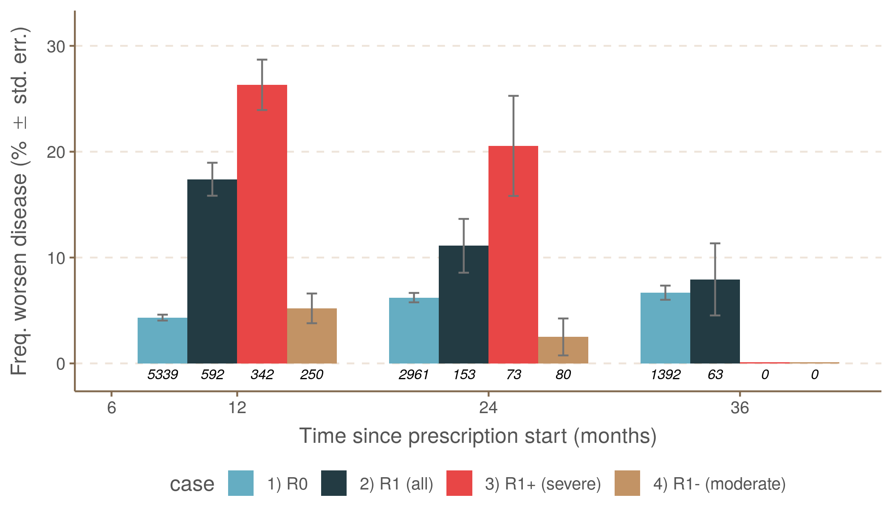
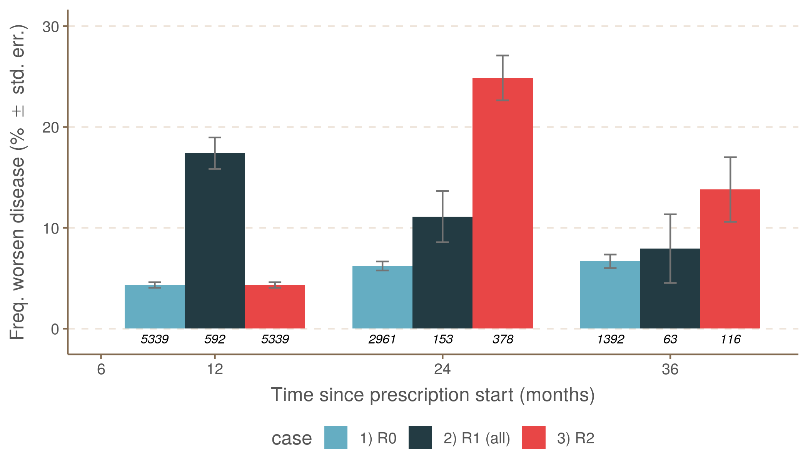
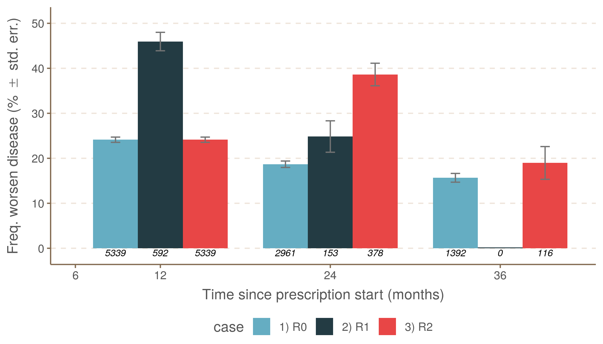

<!-- README.md is generated from README.Rmd. Please edit that file -->

# RPack.PIRA

<!-- badges: start -->

[](https://www.tidyverse.org/lifecycle/#maturing)
<!-- badges: end -->

This is the analysis behind the *Assessment of Disability Progression
Independent of Relapse and Brain MRI Activity in Patients with Multiple
Sclerosis in Poland* (Kapica-Topczewska et al. 2021), a peer-reviewed
paper available at: <https://www.mdpi.com/2077-0383/10/4/868>. The code
has not been further optimised but reproduces with fidelity the reported
results.

## Installation

You can install the released version of `RPack.PIRA` from
[GitHub](https://github.com/FCACollin/rpack_pira) with:

``` r
# install.packages("devtools")
devtools::install_github("FCACollin/rpack_pira")
```

## Analysis Run

``` r
library(RPack.PIRA)
library(ggplot2)
library(emmeans)

if (require(ggthemr)) ggthemr::ggthemr("fresh") 

captions <- function(x) {
  list(
    fig1 = "**Figure 1.** Comparison between observed frequencies of worsening
    diseases and month of observation when no relapse was ever recorded.
    The upper pane uses the complete set of observations
    (green; label at y = 1 is \"All\"),
      the middle pane uses first- and second-line treatment
      (label at y = 1; first-line, dark brown; second-line, dark blue),
      and the lower pane uses drug
      (label at y = 1; Fingolimod, red, FTY; Glatiramer Acetate, dark blue,
        GLA; Interferon, blue, INF; Natalizumab, light brown, NAT).
      Abundance is represented by transparency and the figure at the top of
      each bar. The error bar represents the standard error estimated as
      p × (1 − p)/n, with p being the number of positives and n the total
      number of observations.  DMT: disease-modifying therapy.
      See <https://www.mdpi.com/2077-0383/10/4/868>,
      @Kapica-Topczewska2021.",
      fig2 = "**Figure 2**. Comparison of disease worsening and one relapse
      during the first year of treatment (between 6 and 12 months).
      Colors are for: R0 = no relapse, R1 = relapse during the first year.
      See <https://www.mdpi.com/2077-0383/10/4/868>,
      @Kapica-Topczewska2021.",
      fig3 = "**Figure 3**.
      Comparison between disease worsening and three scenarios:
      R0 (no relapse), R1 (relapse during the first year),
      and R2 (relapse during the second year).
      See <https://www.mdpi.com/2077-0383/10/4/868>,
      @Kapica-Topczewska2021.",
      fig4 = "**Figure 4**.
      Comparison between MRI activity and the three scenarios:
      R0 (no relapse), R1 (relapse during the first year), and
      R2 (relapse during the second year).
      See <https://www.mdpi.com/2077-0383/10/4/868>,
      @Kapica-Topczewska2021.",
      fig5 = "**Figure 5.** Comparison between the observed frequencies of MRI
      activity and month of observation when no relapse was
      ever recorded. The upper pane uses the complete set of observations
      (green; label at y = 1 is “All”), the middle pane uses
      first- and second-line treatment (label at y = 1; first-line, dark brown;
        second-line, dark blue), and the lower pane uses the
      drug (label at y = 1; Fingolimod, red, FTY;
        Glatiramer Acetate, dark blue, GLA; Interferon, blue, INF; Natalizumab,
        light brown, NAT). DMT: disease-modifying therapy.
      See <https://www.mdpi.com/2077-0383/10/4/868>,
      @Kapica-Topczewska2021.",
      fig6 = "**Figure 6**. Patients with evidenced disease progression:
      the proportion of estimations derived from observation of patients
      never associated with any relapses or brain MRI activity between 12
      and 60 months from the prescription start. The upper
      pane uses the complete set of observations
      (green; label at y = 1 is “All”), the middle pane uses first- and
      second-line treatment (label at y = 1; first-line, dark brown;
        second-line, dark blue), and the lower pane uses the drug
      (label at y = 1; Fingolimod, red, FTY;
        Glatiramer Acetate, dark blue, GLA; Interferon, blue, INF;
        Natalizumab, light brown, NAT). The
      error bar represents the standard error estimated asp × (1 − p)/n,
      with p being the number of positives and n the total
      number of observations. DMT: disease-modifying therapy.
      See <https://www.mdpi.com/2077-0383/10/4/868>,
      @Kapica-Topczewska2021."
      )[[x]]
} 
```

### Patient characteristics

``` r
X <- split(ADPIRA, f = list(ADPIRA$presc_months_cat, ADPIRA$ARM))

tbl <- do.call(
  rbind, lapply(
    X, function(x){

      data.frame(
        Arm = unique(x$ARMCD),
        Month = unique(x$presc_months),
        n = nrow(x),
        F.M = round(sum(x$sex == "female") / sum(x$sex == "male"), 2),
        age = round(median(x$age)),
        AgeSympt = round(median(x$AgeSympt), 2),
        Sympt2Presc = round(median(x$Sympt2Presc)/365.25, 2),
        rlp_n = sum(x$n_rlps_12m > 0),
        EDSS_start  = round(median(x$EDSS_start), 1),
        EDSS_current = round(median(x$EDSS_current), 1),
        Worse_n = sum(x$worse)
      )

    }
  )
)

knitr::kable(
  tbl,
  caption = "Patient characteristics.
  Abbreviations: Arm = arm of the study;
  R0 = no relapse during treatment; R1, R2 = the occurrence of relapse
  during the first and the second year of treatment, respectively;
  MRI = magnetic resonance imaging; M = months; n = number;
  F:M = female to male ratio;
  Age Symptoms = age at the first symptoms;
  Symptoms = duration from the first symptoms to prescription start in years;
  EDSS = The Expanded Disability Status Scale;
  Worsening number = number of patients with disease worsening.",
  row.names = FALSE,
  col.names = c(
    Arm = "Arm", Month = "M", n = "n", "F.M" = "F:M", age = "Age",
    AgeSympt = "Age Symptoms", Sympt2Presc = "Symptoms",
    rlp_n   = "Relapse Number", EDSS_start = "EDSS Baseline",
    Worse_n = "Worsening Number"
    )[names(tbl)]
)
```

| Arm     |  M |    n |  F:M | Age | Age Symptoms | Symptoms | Relapse Number | EDSS Baseline |  NA | Worsening Number |
| :------ | -: | ---: | ---: | --: | -----------: | -------: | -------------: | ------------: | --: | ---------------: |
| R0      | 12 | 5339 | 2.32 |  36 |         30.0 |     3.61 |              0 |           1.5 | 1.5 |              231 |
| R0      | 24 | 2961 | 2.24 |  37 |         30.0 |     3.78 |              0 |           1.5 | 1.5 |              184 |
| R0      | 36 | 1392 | 2.20 |  36 |         30.0 |     3.38 |              0 |           1.5 | 1.5 |               93 |
| R0      | 48 |  525 | 2.28 |  36 |         31.0 |     3.48 |              0 |           1.5 | 1.5 |               40 |
| R0      | 60 |  255 | 2.04 |  36 |         31.0 |     3.16 |              0 |           1.0 | 1.0 |               21 |
| R0+MRI0 | 12 | 4051 | 2.38 |  37 |         31.0 |     3.90 |              0 |           2.0 | 1.5 |              170 |
| R0+MRI0 | 24 | 2010 | 2.33 |  38 |         31.0 |     4.22 |              0 |           1.5 | 1.5 |              130 |
| R0+MRI0 | 36 |  885 | 2.16 |  38 |         31.0 |     3.78 |              0 |           1.5 | 1.5 |               67 |
| R0+MRI0 | 48 |  296 | 2.75 |  38 |         32.0 |     3.78 |              0 |           1.5 | 1.5 |               27 |
| R0+MRI0 | 60 |  139 | 2.56 |  38 |         32.0 |     3.65 |              0 |           1.0 | 1.0 |               11 |
| R1-     | 12 |  250 | 2.52 |  35 |         28.0 |     4.21 |              0 |           2.0 | 2.2 |               13 |
| R1-     | 24 |   80 | 3.00 |  36 |         28.0 |     4.77 |              0 |           2.2 | 2.0 |                2 |
| R1-     | 36 |   40 | 2.33 |  37 |         29.5 |     3.32 |              0 |           2.0 | 2.0 |                0 |
| R1-     | 48 |   12 | 2.00 |  30 |         27.0 |     2.45 |              0 |           2.0 | 1.8 |                0 |
| R1-     | 60 |    6 | 2.00 |  33 |         29.0 |     1.81 |              0 |           2.0 | 2.0 |                1 |
| R1      | 12 |  592 | 2.23 |  35 |         28.0 |     4.06 |              0 |           2.0 | 2.5 |              103 |
| R1      | 24 |  153 | 2.48 |  35 |         28.0 |     4.37 |              0 |           2.0 | 2.0 |               17 |
| R1      | 36 |   63 | 1.86 |  37 |         29.0 |     3.69 |              0 |           2.0 | 2.0 |                5 |
| R1      | 48 |   21 | 2.00 |  32 |         28.0 |     2.57 |              0 |           1.5 | 1.5 |                0 |
| R1      | 60 |   10 | 1.50 |  30 |         27.0 |     2.03 |              0 |           1.5 | 1.8 |                1 |
| R1+     | 12 |  342 | 2.05 |  35 |         28.0 |     4.00 |              0 |           2.0 | 2.5 |               90 |
| R1+     | 24 |   73 | 2.04 |  34 |         28.0 |     3.98 |              0 |           2.0 | 2.0 |               15 |
| R1+     | 36 |   23 | 1.30 |  36 |         27.0 |     4.31 |              0 |           2.0 | 2.5 |                5 |
| R1+     | 48 |    9 | 2.00 |  35 |         30.0 |     2.79 |              0 |           1.5 | 1.5 |                0 |
| R1+     | 60 |    4 | 1.00 |  28 |         24.0 |     2.97 |              0 |           1.2 | 1.2 |                0 |
| R2      | 12 | 5339 | 2.32 |  36 |         30.0 |     3.61 |              0 |           1.5 | 1.5 |              231 |
| R2      | 24 |  378 | 2.26 |  37 |         30.0 |     3.46 |              0 |           2.0 | 2.0 |               94 |
| R2      | 36 |  116 | 1.37 |  38 |         32.0 |     2.89 |              0 |           2.0 | 2.0 |               16 |
| R2      | 48 |   31 | 2.10 |  38 |         32.0 |     2.16 |              0 |           1.5 | 2.0 |                5 |
| R2      | 60 |   12 | 3.00 |  38 |         34.0 |     1.75 |              0 |           1.2 | 1.8 |                3 |

Patient characteristics. Abbreviations: Arm = arm of the study; R0 = no
relapse during treatment; R1, R2 = the occurrence of relapse during the
first and the second year of treatment, respectively; MRI = magnetic
resonance imaging; M = months; n = number; F:M = female to male ratio;
Age Symptoms = age at the first symptoms; Symptoms = duration from the
first symptoms to prescription start in years; EDSS = The Expanded
Disability Status Scale; Worsening number = number of patients with
disease worsening.

### Disease progression and relapses

``` r
norlp <- subset(ADPIRA, ARMCD == "R0")
X <- split(x = norlp, f = norlp$presc_months_cat)
Xline <- split(
  x = norlp, f = with(norlp, paste(presc_months_cat, treatment_line))
)
Xpres <- split(
  x = norlp, f = with(norlp, paste(presc_months_cat, prescription)),
  drop = TRUE
)

FUN <- function(
  x,
  criteria = c("worse", "dMRI_12m"),
  drug = FALSE, case = NA, line = FALSE) {

  criteria <- match.arg(criteria)
  y <- data.frame(
    Time = unique(x$presc_months_cat),
    n = nrow(x),
    x = sum(x[[criteria]]),
    line = ifelse(line & !drug, as.character(unique(x$treatment_line)), ""),
    drug = ifelse(drug, unique(x$prescription), ""),
    case = case,
    stringsAsFactors = FALSE
  )

  y$p <- y$x / y$n
  y$halfCI <- 1.96 * sqrt((y$p * (1 - y$p)) / y$n)
  y$halfCI <- sqrt( (y$p*(1-y$p))/ y$n)
  y$up <- ifelse(y$p + y$halfCI < 1, y$p + y$halfCI, 1)
  y$lo <- ifelse(y$p - y$halfCI > 0, y$p - y$halfCI, 0)

  y

}

dtaplot <- rbind(
  do.call(rbind, lapply(X, FUN, case = "1) All")),
  do.call(rbind, lapply(Xline, FUN, case = "2) line", line = TRUE)),
  do.call(rbind, lapply(Xpres, FUN, case = "3) drug", line = TRUE, drug = TRUE))
)

dtaplot <- subset(dtaplot, (up - lo) < .1)

# Graph fine tuning.
dtaplot <- rbind(
  dtaplot,
  data.frame(
    Time = c(48, 48, 60, 60, 60, 48, 60),
    n = 0,
    x = NA,
    line = c(
      "", "", "", "", "",
      "II", "II"
      ),
    drug = c(
      "FTY", "NAT", "FTY", "NAT", "GLA",
      "", ""
      ),
    case = c(
      "3) drug", "3) drug", "3) drug", "3) drug", "3) drug",
      "2) line", "2) line"
      ),
    lo = NA,
    up = NA,
    halfCI = NA,
    p = 0.001
  )
)
dtaplot$Colour <- with(
  dtaplot, ifelse(
    case == "1) All", "All", 
    ifelse(case == "2) line", line, drug)
  )
)
dtaplot$Colour <- factor(
  dtaplot$Colour, levels = c("INF", "GLA", "FTY", "NAT", "I", "II", "All")
)
dtaplot$case <- factor(
  dtaplot$case, levels = c("1) All", "2) line", "3) drug"),
  labels = c("All", "Line", "DMT")
)

gg <- {
  ggplot(
    data = dtaplot,
    mapping = aes(
      x = Time, y = 100 * p,
      size = n,
      colour = Colour,
      fill = Colour,
      label = n,
      ymax = 100 * up, ymin = 100 * lo
    )
    ) + geom_col(
    position = "dodge",
    color = NA, size = 1, width = 9.5,
    alpha = .8
    ) + geom_errorbar(
    size = .5, alpha = 1, width = 2, position = position_dodge(width = 9.5),
    color = "gray45" 
    ) + scale_alpha_continuous(
    range = c(min = .3, max = .9)
    ) + coord_cartesian(
    ylim = c(-1, max(15, dtaplot$up *100, na.rm = TRUE)),
    xlim = c(6, 65)
    ) + geom_text(
    mapping = aes(y = 100*up),
    alpha = 1, size = 2.8, position = position_dodge(width = 9.5),
    vjust = -1.2,
    color = "black",
    fontface = "italic"
    ) + geom_label(
    mapping = aes(label = Colour), y = -.75,
    alpha = 1, size = 2, position = position_dodge(width = 9.5),
    colour = "white"
    ) + scale_x_continuous(
    breaks = c(6, seq(0 , 60, 12))
    ) + ylab(
    expression("Freq. worsen disease (% "%+-%" std. err.)")
    ) + xlab(
    "Time since prescription start (months)"
    ) + facet_grid(
    case~.
    ) + theme(
    legend.position = "none",
    panel.grid.major.x = element_blank(),
    panel.background = element_blank()
  )
}

gg
#> Warning: Removed 7 rows containing missing values (geom_text).
```

<div class="figure">


<p class="caption">

**Figure 1.** Comparison between observed frequencies of worsening
diseases and month of observation when no relapse was ever recorded. The
upper pane uses the complete set of observations (green; label at y = 1
is “All”), the middle pane uses first- and second-line treatment (label
at y = 1; first-line, dark brown; second-line, dark blue), and the lower
pane uses drug (label at y = 1; Fingolimod, red, FTY; Glatiramer
Acetate, dark blue, GLA; Interferon, blue, INF; Natalizumab, light
brown, NAT). Abundance is represented by transparency and the figure at
the top of each bar. The error bar represents the standard error
estimated as p × (1 − p)/n, with p being the number of positives and n
the total number of observations. DMT: disease-modifying therapy. See
<https://www.mdpi.com/2077-0383/10/4/868>, Kapica-Topczewska et al.
(2021).

</p>

</div>

``` r
norlp <- subset(ADPIRA, ARMCD == "R0")
onerlp <- subset(ADPIRA, ARMCD == "R1")
onebadrlp <- subset(ADPIRA, ARMCD == "R1+")
onelowrlp <- subset(ADPIRA, ARMCD == "R1-")

Xnr <- split(x = norlp, f = norlp$presc_months_cat)
Xor <- split(x = onerlp, f = onerlp$presc_months_cat)
Xbr <- split(x = onebadrlp, f = onebadrlp$presc_months_cat)
Xlr <- split(x = onelowrlp, f = onelowrlp$presc_months_cat)

dtaplot <- rbind(
  do.call(rbind, lapply(Xnr, FUN, case = "1) R0")),
  do.call(rbind, lapply(Xor, FUN, case = "2) R1 (all)")),
  do.call(rbind, lapply(Xbr, FUN, case = "3) R1+ (severe)")),
  do.call(rbind, lapply(Xlr, FUN, case = "4) R1- (moderate)"))
)

dtaplot <- subset(
  dtaplot, 
  (up - lo) < .15  & (up + lo) > 0 & Time %in% seq(12, 36, 12)
)
dtaplot <- rbind(
  dtaplot,
  data.frame(
    Time = c(36, 36),
    n = c(0, 0),
    x = NA,
    line = "",
    drug = "",
    case = c("3) R1+ (severe)", "4) R1- (moderate)"),
    lo = NA,
    up = NA,
    halfCI = NA,
    p = 0.001
  )
)
gg <- {
  ggplot(
    data = dtaplot,
    mapping = aes(
      x = Time, y = 100*p,
      size = n,
      colour = case,
      fill = case,
      label = n,
      ymax = 100*up, ymin = 100*lo
    )
    ) + geom_col(
    position = "dodge",
    color = NA, size = 1, width = 9.5
    ) + geom_errorbar(
    size = .5, alpha = 1, width = 2, position = position_dodge(width = 9.5),
    color = "gray45" 
    ) + scale_alpha_continuous(
    range = c(min = .3, max = .9)
    ) + coord_cartesian(
    ylim = c(-1, max(15, dtaplot$up *100+3, na.rm = TRUE)),
    xlim = c(6, 41)
    ) + geom_text(
    y = -1,
    alpha = 1, size = 2.8, position = position_dodge(width = 9.5),
    color = "black",
    fontface = "italic"
    ) + scale_x_continuous(
    breaks = c(6, seq(0 , 36, 12))
    ) + ylab(
    expression("Freq. worsen disease (% "%+-%" std. err.)")
    ) + xlab(
    "Time since prescription start (months)"
    ) + theme(
    legend.position = "bottom",
    panel.grid.major.x = element_blank(),
    panel.background = element_blank()
  )
}

gg
```

<div class="figure">



<p class="caption">

**Figure 2**. Comparison of disease worsening and one relapse during the
first year of treatment (between 6 and 12 months). Colors are for: R0 =
no relapse, R1 = relapse during the first year. See
<https://www.mdpi.com/2077-0383/10/4/868>, Kapica-Topczewska et al.
(2021).

</p>

</div>

### Disease progression and MRI Activity

``` r
norlp <- subset(ADPIRA, ARMCD == "R0")
onerlp <- subset(ADPIRA, ARMCD == "R1")
oneY2rlp <- subset(ADPIRA, ARMCD == "R2")

Xnr     <- split(x = norlp, f = norlp$presc_months_cat)
Xor     <- split(x = onerlp, f = onerlp$presc_months_cat)
X2r     <- split(x = oneY2rlp, f = oneY2rlp$presc_months_cat)

dtaplot <- rbind(
  do.call(rbind, lapply(Xnr, FUN, case = "1) R0"))
  , do.call(rbind, lapply(Xor, FUN, case = "2) R1 (all)"))
  , do.call(rbind, lapply(X2r, FUN, case = "3) R2"))
  );

dtaplot <- subset(
  dtaplot, 
  (up - lo) < .10  & (up + lo) > 0 & Time %in% seq(12, 36, 12)
)

gg <- {
  ggplot(
    data = dtaplot,
    mapping = aes(
      x = Time, y = 100*p,
      size = n,
      colour = case,
      fill = case,
      label = n,
      ymax = 100*up, ymin = 100*lo
    )
    ) + geom_col(
    position = "dodge",
    color = NA, size = 1, width = 9.5
    ) + geom_errorbar(
    size = .5, alpha = 1, width = 2, position = position_dodge(width = 9.5),
    color = "gray45" 
    ) + scale_alpha_continuous(
    range = c(min = .3, max = .9)
    ) + coord_cartesian(
    ylim = c(-1, max(15, dtaplot$up *100+3, na.rm = TRUE)),
    xlim = c(6, 41)
    ) + geom_text(
    y = -1,
    alpha = 1, size = 2.8, position = position_dodge(width = 9.5),
    color = "black",
    fontface = "italic"
    ) + scale_x_continuous(
    breaks = c(6, seq(0 , 36, 12))
    ) + ylab(
    expression("Freq. worsen disease (% "%+-%" std. err.)")
    ) + xlab(
    "Time since prescription start (months)"
    ) + theme(
    legend.position = "bottom",
    panel.grid.major.x = element_blank(),
    panel.background = element_blank()
  )
}

gg
```

<div class="figure">



<p class="caption">

**Figure 3**. Comparison between disease worsening and three scenarios:
R0 (no relapse), R1 (relapse during the first year), and R2 (relapse
during the second year). See <https://www.mdpi.com/2077-0383/10/4/868>,
Kapica-Topczewska et al. (2021).

</p>

</div>

``` r
norlp <- subset(ADPIRA, ARMCD == "R0")
onerlp <- subset(ADPIRA, ARMCD == "R1")
oneY2rlp <- subset(ADPIRA, ARMCD == "R2")

Xnr <- split(x = norlp, f = norlp$presc_months_cat)
Xor <- split(x = onerlp, f = onerlp$presc_months_cat)
X2r <- split(x = oneY2rlp, f = oneY2rlp$presc_months_cat)

FUN <- function(x, drug = FALSE, case = NA, line = FALSE){

  y <- data.frame(
    Time = unique(x$presc_months_cat),
    n    = nrow(x),                    # n cases
    x    = sum(x$dMRI_12m >= 1),                # positive cases
    line = ifelse(line & !drug, as.character(unique(x$treatment_line)), ''),
    drug = ifelse(drug, unique(x$prescription), ''),
    case = case,
    stringsAsFactors = FALSE
    );

  y <- within(
    data = y,
    expr = {
      p      <- x/n;
      halfCI <- 1.96 *sqrt( (p*(1-p))/ n)
      halfCI <- sqrt( (p*(1-p))/ n)
      up     <- ifelse(p + halfCI < 1, p + halfCI, 1)
      lo     <- ifelse(p - halfCI > 0, p - halfCI, 0)
    }
  )

  return(y)

}

dtaplot <- rbind(
  do.call(rbind, lapply(Xnr, FUN, case = "1) R0")),
  do.call(rbind, lapply(Xor, FUN, case = "2) R1")),
  do.call(rbind, lapply(X2r, FUN, case = "3) R2"))
)

dtaplot <- subset(
  dtaplot, 
  (up - lo) < .10  & (up + lo) > 0 & Time %in% seq(12, 36, 12)
)

dtaplot <- rbind(
  dtaplot,
  data.frame(
    Time = 36,
    n = 0,
    x = NA,
    line = "",
    drug = "",
    case = c("2) R1"),
    lo = NA,
    up = NA,
    halfCI = NA,
    p = 0.002
  )
)

gg <- {
  ggplot(
    data = dtaplot,
    mapping = aes(
      x = Time, y = 100*p,
      size = n,
      colour = case,
      fill = case,
      label = n,
      ymax = 100*up, ymin = 100*lo
    )
    ) + geom_col(
    position = "dodge",
    color = NA, size = 1, width = 9.5
    ) + geom_errorbar(
    size = .5, alpha = 1, width = 2, position = position_dodge(width = 9.5),
    color = "gray45" 
    ) + scale_alpha_continuous(
    range = c(min = .3, max = .9)
    ) + coord_cartesian(
    ylim = c(-1, max(15, dtaplot$up *100+3, na.rm = TRUE)),
    xlim = c(6, 41)
    ) + geom_text(
    y = -1,
    alpha = 1, size = 2.8, position = position_dodge(width = 9.5),
    color = "black",
    fontface = "italic"
    ) + scale_x_continuous(
    breaks = c(6, seq(0 , 36, 12))
    ) + ylab(
    expression("Freq. worsen disease (% "%+-%" std. err.)")
    ) + xlab(
    "Time since prescription start (months)"
    ) + theme(
    legend.position = "bottom",
    panel.grid.major.x = element_blank(),
    panel.background = element_blank()
  )

}

gg
```

<div class="figure">



<p class="caption">

**Figure 4**. Comparison between MRI activity and the three scenarios:
R0 (no relapse), R1 (relapse during the first year), and R2 (relapse
during the second year). See <https://www.mdpi.com/2077-0383/10/4/868>,
Kapica-Topczewska et al. (2021).

</p>

</div>

``` r
#[FC/200121/14:45]# graph MRI worsening? 

norlp <- subset(ADPIRA, ARMCD == "R0")

X     <- split(x = norlp, f = norlp$presc_months_cat)
Xline <- split(x = norlp, f = with(norlp, paste(presc_months_cat, treatment_line)))
Xpres <- split(
  x = norlp, f = with(norlp, paste(presc_months_cat, prescription)),
  drop = TRUE
)

FUN <- function(x, drug = FALSE, case = NA, line = FALSE){

  y <- data.frame(
    Time = unique(x$presc_months_cat),
    n    = nrow(x),                            # n cases
    x    = sum(x$dMRI_12m >=1),                # positive cases
    line = ifelse(line & !drug, as.character(unique(x$treatment_line)), ''),
    drug = ifelse(drug, unique(x$prescription), ''),
    case = case,
    stringsAsFactors = FALSE
    );

  y <- within(
    data = y,
    expr = {
      p      <- x/n;
      halfCI <- 1.96 *sqrt( (p*(1-p))/ n);
      halfCI <- sqrt( (p*(1-p))/ n);
      up     <- ifelse(p + halfCI < 1, p + halfCI, 1);
      lo     <- ifelse(p - halfCI > 0, p - halfCI, 0);
    }
    );

  return(y);

}

dtaplot <- rbind(
  do.call(rbind, lapply(X, FUN, case = "1) All"))
  , do.call(rbind, lapply(Xline, FUN, case = "2) line", line = TRUE))
  , do.call(rbind, lapply(Xpres, FUN, case = "3) drug", line = TRUE, drug = TRUE))
)

dtaplot <- subset(
  dtaplot, 
  !(drug %in% c("DMF", "PEG")) 
  & (up - lo) < .1
)

dtaplot <- rbind(
  dtaplot,
  data.frame(
    Time = c(48, 48, 48, 60, 60, 60, 48, 60),
    n = 0,
    x = NA,
    line = c("", "", "", "", "", "", "II", "II"),
    drug = c("GLA", "FTY", "NAT", "FTY", "NAT", "GLA", "", ""),
    case = c(
      "3) drug", "3) drug", "3) drug", "3) drug", "3) drug", "3) drug",
      "2) line", "2) line"
      ),
    lo = NA,
    up = NA,
    halfCI = NA,
    p = 0.001
  )
)

dtaplot$Colour <- with(
  dtaplot, ifelse(
    case == "1) All", "All", 
    ifelse(case == "2) line", line, drug)
  )
)

dtaplot$Colour <- factor(
  dtaplot$Colour, levels = c("INF", "GLA", "FTY", "NAT", "I", "II", "All")
)
dtaplot$case <- factor(
  dtaplot$case, levels = c("1) All", "2) line", "3) drug"),
  labels = c("All", "Line", "DMT")
)


gg <- {
  ggplot(
    data = dtaplot,
    mapping = aes(
      x = Time, y = 100*p,
      size = n,
      colour = Colour,
      fill = Colour,
      label = n,
      ymax = 100*up, ymin = 100*lo
    )
    ) + geom_col(
    position = "dodge",
    color = NA, size = 1, width = 9.5,
    alpha = .8
    ) + geom_errorbar(
    size = .5, alpha = 1, width = 2, position = position_dodge(width = 9.5),
    color = "gray45" 
    ) + scale_alpha_continuous(
    range = c(min = .3, max = .9)
    ) + coord_cartesian(
    ylim = c(-1.5, 32),
    xlim = c(6, 65)
    ) + geom_text(
    mapping = aes(y = 100*up),
    alpha = 1, size = 2.8, position = position_dodge(width = 9.5),
    vjust = -1.2,
    color = "black",
    fontface = "italic"
    ) + geom_label(
    mapping = aes(label = Colour), y = -1.5,
    alpha = 1, size = 2, position = position_dodge(width = 9.5),
    colour = "white"
    ) + scale_x_continuous(
    breaks = c(6, seq(0 , 60, 12))
    ) + ylab(
    "Freq. MRI activity (%, +/- std. err.)"
    ) + xlab(
    "Time since prescription start (months)"
    ) + facet_grid(
    case~.
    ) + theme(
    legend.position = "none",
    panel.grid.major.x = element_blank(),
    panel.background = element_blank()
  )
}

gg
#> Warning: Removed 8 rows containing missing values (geom_text).
```

<div class="figure">


<p class="caption">

**Figure 5.** Comparison between the observed frequencies of MRI
activity and month of observation when no relapse was ever recorded. The
upper pane uses the complete set of observations (green; label at y = 1
is “All”), the middle pane uses first- and second-line treatment (label
at y = 1; first-line, dark brown; second-line, dark blue), and the lower
pane uses the drug (label at y = 1; Fingolimod, red, FTY; Glatiramer
Acetate, dark blue, GLA; Interferon, blue, INF; Natalizumab, light
brown, NAT). DMT: disease-modifying therapy. See
<https://www.mdpi.com/2077-0383/10/4/868>, Kapica-Topczewska et al.
(2021).

</p>

</div>

### Disease progression: relapses and MRI Activity

``` r
pirma <- subset(ADPIRA, ARMCD == "R0+MRI0")
X     <- split(x = pirma, f = pirma$presc_months_cat)
Xline <- split(x = pirma, f = with(pirma, paste(presc_months_cat, treatment_line)))
Xpres <- split(
  x = pirma, f = with(pirma, paste(presc_months_cat, prescription)),
  drop = TRUE
)

FUN <- function(x, drug = FALSE, case = NA, line = FALSE){

  y <- data.frame(
    Time = unique(x$presc_months_cat),
    n    = nrow(x),                    # n cases
    x    = sum(x$worse),               # positive cases
    line = ifelse(line & !drug, as.character(unique(x$treatment_line)), ''),
    drug = ifelse(drug, unique(x$prescription), ''),
    case = case,
    stringsAsFactors = FALSE
    );

  y <- within(
    data = y,
    expr = {
      p      <- x/n;
      halfCI <- 1.96 *sqrt( (p*(1-p))/ n);
      halfCI <- sqrt( (p*(1-p))/ n);
      up     <- ifelse(p + halfCI < 1, p + halfCI, 1);
      lo     <- ifelse(p - halfCI > 0, p - halfCI, 0);
    }
    );

  return(y);

}

dtaplot <- rbind(
  do.call(rbind, lapply(X, FUN, case = "1) All"))
  , do.call(rbind, lapply(Xline, FUN, case = "2) line", line = TRUE))
  , do.call(rbind, lapply(Xpres, FUN, case = "3) drug", line = TRUE, drug = TRUE))
  );

dtaplot <- subset(
  dtaplot, 
  !(drug %in% c("DMF", "PEG")) 
  & (up - lo) < .1
)

dtaplot <- rbind(
  dtaplot,
  data.frame(
    Time = c(48, 48, 48, 60, 60, 60, 48, 60),
    n = 0,
    x = NA,
    line = c("", "", "", "", "", "", "II", "II"),
    drug = c("GLA", "FTY", "NAT", "FTY", "NAT", "GLA", "", ""),
    case = c(
      "3) drug", "3) drug", "3) drug", "3) drug", "3) drug", "3) drug",
      "2) line", "2) line"
      ),
    lo = NA,
    up = NA,
    halfCI = NA,
    p = 0.0005
  )
)

dtaplot$Colour <- with(
  dtaplot, ifelse(
    case == "1) All", "All", 
    ifelse(case == "2) line", line, drug)
  )
)

dtaplot$Colour <- factor(
  dtaplot$Colour, levels = c("INF", "GLA", "FTY", "NAT", "I", "II", "All")
)
dtaplot$case <- factor(
  dtaplot$case, levels = c("1) All", "2) line", "3) drug"),
  labels = c("All", "Line", "DMT")
)


gg <- {
  ggplot(
    data = dtaplot,
    mapping = aes(
      x = Time, y = 100*p,
      size = n,
      colour = Colour,
      fill = Colour,
      label = n,
      ymax = 100*up, ymin = 100*lo
    )
    ) + geom_col(
    position = "dodge",
    color = NA, size = 1, width = 9.5,
    alpha = .8
    ) + geom_errorbar(
    size = .5, alpha = 1, width = 2, position = position_dodge(width = 9.5),
    color = "gray45" 
    ) + scale_alpha_continuous(
    range = c(min = .3, max = .9)
    ) + coord_cartesian(
    ylim = c(-.75, 12),
    xlim = c(6, 65)
    ) + geom_text(
    mapping = aes(y = 100*up),
    alpha = 1, size = 2.8, position = position_dodge(width = 9.5),
    vjust = -1.2,
    color = "black",
    fontface = "italic"
    ) + geom_label(
    mapping = aes(label = Colour), y = -.75,
    alpha = 1, size = 2, position = position_dodge(width = 9.5),
    colour = "white"
    ) + scale_x_continuous(
    breaks = c(6, seq(0 , 60, 12))
    ) + ylab(
    expression("Freq. worsen disease (% "%+-%" std. err.)")
    ) + xlab(
    "Time since prescription start (months)"
    ) + facet_grid(
    case~.
    ) + theme(
    legend.position = "none",
    panel.grid.major.x = element_blank(),
    panel.background = element_blank()
    );
}

gg
#> Warning: Removed 8 rows containing missing values (geom_text).
```

<div class="figure">


<p class="caption">

**Figure 6**. Patients with evidenced disease progression: the
proportion of estimations derived from observation of patients never
associated with any relapses or brain MRI activity between 12 and 60
months from the prescription start. The upper pane uses the complete set
of observations (green; label at y = 1 is “All”), the middle pane uses
first- and second-line treatment (label at y = 1; first-line, dark
brown; second-line, dark blue), and the lower pane uses the drug (label
at y = 1; Fingolimod, red, FTY; Glatiramer Acetate, dark blue, GLA;
Interferon, blue, INF; Natalizumab, light brown, NAT). The error bar
represents the standard error estimated asp × (1 − p)/n, with p being
the number of positives and n the total number of observations. DMT:
disease-modifying therapy. See
<https://www.mdpi.com/2077-0383/10/4/868>, Kapica-Topczewska et al.
(2021).

</p>

</div>

### Modele: Probability of Disease Worsening

``` r
# > "*overdispersion when residual deviance is larger than residual degrees of
# > freedom*" [@Crawley2013]

res_glm <- list()

#[FC/200728/07:18]# R0 {{{

res_glm$R0$data <- with(
  data = subset(ADPIRA, ARMCD == "R0"),
  expr = {
    data.frame(
      Time = factor(presc_months_cat),
      ARMCD = ARMCD,
      line = treatment_line,
      drug = prescription,
      sex = sex,
      age = age,
      EDSS = EDSS_start,
      worse
    )
  }
)

res_glm$R0$glm <- glm(
  worse ~ Time + (age + EDSS), data = res_glm$R0$data,
  family = binomial(link = "logit")
)

###}}} -- vim fold
#[FC/200728/07:18]# R1 {{{

res_glm$R1$data <- with(
  data = subset(ADPIRA, ARMCD == "R1" & ! presc_months_cat %in% c(48, 60)),
  expr = {
    data.frame(
      Time = factor(presc_months_cat),
      ARMCD = ARMCD,
      line = treatment_line,
      drug = prescription,
      sex = sex,
      age = age,
      EDSS = EDSS_start,
      worse
    )
  }
)

res_glm$R1$glm <- glm(
  worse ~ Time * (age + EDSS + line + sex)
  -Time:sex -Time:drug -Time:line -line -Time:age -Time:EDSS -age,
  data = res_glm$R1$data,
  family = binomial(link = "logit")
)

###}}} -- vim fold
#[FC 200807 07:14]# R1+ {{{

res_glm$`R1+`$data <- with(
  data = subset(ADPIRA, ARMCD == "R1+" & ! presc_months_cat %in% c(48, 60)),
  expr = {
    data.frame(
      Time = factor(presc_months_cat),
      ARMCD = ARMCD,
      line = treatment_line,
      drug = prescription,
      sex = sex,
      age = age,
      EDSS = EDSS_start,
      worse
    )
  }
)

res_glm$`R1+`$glm <- glm(
  worse ~ Time + EDSS + sex,
  #   worse ~ Time * (age + EDSS + line + sex + drug)
  #   -Time:line -Time:EDSS -Time:age -line -Time:drug -drug -age -Time:sex,
  data = res_glm$`R1+`$data,
  family = binomial(link = "logit")
)

###}}} -- vim fold
#[FC 200807 07:14]# R1- {{{

res_glm$`R1-`$data <- with(
  data = subset(ADPIRA, ARMCD == "R1-" & ! presc_months_cat %in% c(36, 48, 60)),
  expr = {
    data.frame(
      Time = factor(presc_months_cat),
      ARMCD = ARMCD,
      line = treatment_line,
      drug = prescription,
      sex = sex,
      age = age,
      EDSS = EDSS_start,
      worse
    )
  }
)

res_glm$`R1-`$glm <- glm(
  worse ~ Time,
  data = res_glm$`R1-`$data,
  family = binomial(link = "logit")
)

###}}} -- vim fold
#[FC/200728/07:18]# R2 {{{

res_glm$R2$data <- with(
  data = subset(ADPIRA, ARMCD == "R2"),
  expr = {
    data.frame(
      Time = factor(presc_months_cat),
      ARMCD = ARMCD,
      line = treatment_line,
      drug = prescription,
      sex = sex,
      age = age,
      EDSS = EDSS_start,
      worse
    )
  }
)

res_glm$R2$glm <- glm(
  worse ~ Time * (age + EDSS + drug + sex) -Time:age -Time:line -Time:drug
  -drug -Time:sex -sex -Time:EDSS, 
  data = res_glm$R2$data,
  family = binomial(link = "logit")
)

###}}} -- vim fold
#[FC/200728/07:18]# R0+MRI0 {{{

res_glm$`R0+MRI0`$data <- with(
  data = subset(ADPIRA, ARMCD == "R0+MRI0"),
  expr = {
    data.frame(
      Time = factor(presc_months_cat),
      ARMCD = ARMCD,
      line = treatment_line,
      drug = prescription,
      sex = sex,
      age = age,
      EDSS = EDSS_start,
      worse
    )
  }
)

res_glm$`R0+MRI0`$glm <- glm(
  worse ~ Time + age + EDSS,
  data = res_glm$`R0+MRI0`$data,
  family = binomial(link = "logit")
)

###}}} -- vim fold
```

``` r
covariates <- c("sex", "line", "drug", "age", "EDSS")
X <- lapply(res_glm, function(x) x$glm)

devianceTables <- lapply(
  X, function(x) {

    covariates <- covariates[! covariates %in% attr(terms(x), "term.labels")]

    y <- lapply(
      covariates, function(y) {
        effect <- y
        y <- update(x, as.formula(paste(" . ~ . +", y)))
        y <- as.data.frame(anova(x, y, test = "Chisq"))
        rownames(y) <- c(
          paste0("[#] ", paste(attr(terms(x), "term.labels"), collapse = "+"))
          , paste0("# + ", effect))
        y
      })

    unique(do.call(rbind, y))

  }
)

devianceTables <- Map(
  function(tbl, name) {
    tbl <- cbind(
      Arm = name,
      Covariates = rownames(tbl),
      tbl
    )
    rownames(tbl) <- NULL
    tbl
  },
  devianceTables, names(devianceTables)
)

devianceTables <- do.call(rbind, devianceTables)
rownames(devianceTables) <- NULL

knitr::kable(
  devianceTables,
  caption = paste(
    "Candiadate covariates. ",
    "The deviance table compares within each Arm the deviance of ",
    "the model [#] to the model including an additional covariate (#+)."
  )
)
```

| Arm     | Covariates           | Resid. Df | Resid. Dev | Df |  Deviance | Pr(\>Chi) |
| :------ | :------------------- | --------: | ---------: | -: | --------: | --------: |
| R0      | \[\#\] Time+age+EDSS |     10465 |  4331.6046 | NA |        NA |        NA |
| R0      | \# + sex             |     10464 |  4331.2730 |  1 | 0.3315723 | 0.5647347 |
| R0      | \# + line            |     10464 |  4329.0596 |  1 | 2.5450096 | 0.1106432 |
| R0      | \# + drug            |     10462 |  4327.1385 |  3 | 4.4660468 | 0.2153389 |
| R1      | \[\#\] Time+EDSS+sex |       803 |   661.1765 | NA |        NA |        NA |
| R1      | \# + line            |       802 |   661.1756 |  1 | 0.0009201 | 0.9758010 |
| R1      | \# + drug            |       800 |   660.5379 |  3 | 0.6386538 | 0.8875292 |
| R1      | \# + age             |       802 |   658.5293 |  1 | 2.6472572 | 0.1037287 |
| R1+     | \[\#\] Time+EDSS+sex |       433 |   474.3609 | NA |        NA |        NA |
| R1+     | \# + line            |       432 |   473.7767 |  1 | 0.5842904 | 0.4446355 |
| R1+     | \# + drug            |       430 |   473.4962 |  3 | 0.8647174 | 0.8339329 |
| R1+     | \# + age             |       432 |   473.6428 |  1 | 0.7181511 | 0.3967510 |
| R1-     | \[\#\] Time          |       328 |   120.8864 | NA |        NA |        NA |
| R1-     | \# + sex             |       327 |   120.8734 |  1 | 0.0129546 | 0.9093820 |
| R1-     | \# + line            |       327 |   120.6265 |  1 | 0.2598883 | 0.6101969 |
| R1-     | \# + drug            |       325 |   117.0125 |  3 | 3.8738161 | 0.2754160 |
| R1-     | \# + age             |       327 |   118.9841 |  1 | 1.9023100 | 0.1678200 |
| R1-     | \# + EDSS            |       327 |   120.8557 |  1 | 0.0307115 | 0.8608857 |
| R2      | \[\#\] Time+age+EDSS |      5869 |  2415.0556 | NA |        NA |        NA |
| R2      | \# + sex             |      5868 |  2414.7703 |  1 | 0.2852875 | 0.5932564 |
| R2      | \# + line            |      5868 |  2415.0038 |  1 | 0.0517659 | 0.8200186 |
| R2      | \# + drug            |      5866 |  2413.0608 |  3 | 1.9947361 | 0.5735000 |
| R0+MRI0 | \[\#\] Time+age+EDSS |      7374 |  3057.5957 | NA |        NA |        NA |
| R0+MRI0 | \# + sex             |      7373 |  3056.4273 |  1 | 1.1683623 | 0.2797380 |
| R0+MRI0 | \# + line            |      7373 |  3056.5877 |  1 | 1.0080140 | 0.3153791 |
| R0+MRI0 | \# + drug            |      7371 |  3055.8399 |  3 | 1.7557917 | 0.6246021 |

Candiadate covariates. The deviance table compares within each Arm the
deviance of the model \[\#\] to the model including an additional
covariate (\#+).

``` r
X <- lapply(res_glm, function(x) x$glm)

effectTest <- lapply(
  X = X,
  FUN = function(x) {
    as.data.frame(broom::tidy(x, exponentiate = TRUE, conf.int = TRUE))
  }
)

effectTest <- Map(
  function(tbl, name) {
    tbl <- cbind(
      Arm = name,
      tbl
    )
    rownames(tbl) <- NULL
    tbl
  },
  effectTest, names(effectTest)
)

effectTest <- do.call(rbind, effectTest)
rownames(effectTest) <- NULL

knitr::kable(
  effectTest,
  caption = "Effect tests."
)
```

| Arm     | term        |  estimate | std.error |    statistic |   p.value |  conf.low |  conf.high |
| :------ | :---------- | --------: | --------: | -----------: | --------: | --------: | ---------: |
| R0      | (Intercept) | 0.0159099 | 0.1758165 | \-23.5519260 | 0.0000000 | 0.0112342 |  0.0223827 |
| R0      | Time24      | 1.4400976 | 0.1019537 |    3.5772217 | 0.0003473 | 1.1783074 |  1.7577058 |
| R0      | Time36      | 1.5530080 | 0.1272181 |    3.4601487 | 0.0005399 | 1.2053054 |  1.9857485 |
| R0      | Time48      | 1.7683206 | 0.1786472 |    3.1908166 | 0.0014187 | 1.2298044 |  2.4816719 |
| R0      | Time60      | 1.9133241 | 0.2389880 |    2.7149566 | 0.0066284 | 1.1652859 |  2.9874159 |
| R0      | age         | 1.0336151 | 0.0042812 |    7.7226589 | 0.0000000 | 1.0249880 |  1.0423384 |
| R0      | EDSS        | 0.8859283 | 0.0377181 |  \-3.2111738 | 0.0013219 | 0.8221604 |  0.9531646 |
| R1      | (Intercept) | 0.3915201 | 0.2156065 |  \-4.3492128 | 0.0000137 | 0.2551541 |  0.5947259 |
| R1      | Time24      | 0.5818220 | 0.2836181 |  \-1.9095769 | 0.0561877 | 0.3238569 |  0.9906386 |
| R1      | Time36      | 0.3929735 | 0.4830662 |  \-1.9335094 | 0.0531735 | 0.1337507 |  0.9242070 |
| R1      | EDSS        | 0.6860285 | 0.0867892 |  \-4.3419709 | 0.0000141 | 0.5762608 |  0.8100402 |
| R1      | sexmale     | 1.7202530 | 0.2046138 |    2.6511962 | 0.0080207 | 1.1481310 |  2.5643997 |
| R1+     | (Intercept) | 0.5791392 | 0.2417755 |  \-2.2591721 | 0.0238727 | 0.3585056 |  0.9268643 |
| R1+     | Time24      | 0.6748859 | 0.3219724 |  \-1.2212586 | 0.2219881 | 0.3485051 |  1.2404674 |
| R1+     | Time36      | 0.7176105 | 0.5300170 |  \-0.6260710 | 0.5312684 | 0.2279344 |  1.8986711 |
| R1+     | EDSS        | 0.7108579 | 0.1002566 |  \-3.4040927 | 0.0006638 | 0.5815889 |  0.8622552 |
| R1+     | sexmale     | 1.7792792 | 0.2315053 |    2.4889635 | 0.0128116 | 1.1283132 |  2.8007257 |
| R1-     | (Intercept) | 0.0548523 | 0.2848552 | \-10.1915316 | 0.0000000 | 0.0298083 |  0.0918916 |
| R1-     | Time24      | 0.4674556 | 0.7706830 |  \-0.9867233 | 0.3237783 | 0.0720818 |  1.7408554 |
| R2      | (Intercept) | 0.0218705 | 0.2136566 | \-17.8914021 | 0.0000000 | 0.0143089 |  0.0330734 |
| R2      | Time24      | 7.9402682 | 0.1396443 |   14.8373222 | 0.0000000 | 6.0225925 | 10.4173481 |
| R2      | Time36      | 3.7069769 | 0.2806290 |    4.6688566 | 0.0000030 | 2.0660900 |  6.2515608 |
| R2      | Time48      | 4.1959623 | 0.4970106 |    2.8854975 | 0.0039080 | 1.4006973 | 10.2462266 |
| R2      | Time60      | 6.6066892 | 0.6763177 |    2.7917095 | 0.0052430 | 1.4455332 | 22.6271134 |
| R2      | age         | 1.0318529 | 0.0054831 |    5.7186566 | 0.0000000 | 1.0208436 |  1.0430317 |
| R2      | EDSS        | 0.7658628 | 0.0527791 |  \-5.0541242 | 0.0000004 | 0.6896365 |  0.8481670 |
| R0+MRI0 | (Intercept) | 0.0161072 | 0.2152669 | \-19.1784490 | 0.0000000 | 0.0105102 |  0.0244448 |
| R0+MRI0 | Time24      | 1.5283783 | 0.1203618 |    3.5244344 | 0.0004244 | 1.2056012 |  1.9333330 |
| R0+MRI0 | Time36      | 1.7960316 | 0.1500578 |    3.9023595 | 0.0000953 | 1.3306328 |  2.3983973 |
| R0+MRI0 | Time48      | 2.1191364 | 0.2180215 |    3.4446541 | 0.0005718 | 1.3554449 |  3.1961796 |
| R0+MRI0 | Time60      | 1.7760974 | 0.3258114 |    1.7630401 | 0.0778937 | 0.8868399 |  3.2193851 |
| R0+MRI0 | age         | 1.0347541 | 0.0051807 |    6.5944005 | 0.0000000 | 1.0243201 |  1.0453413 |
| R0+MRI0 | EDSS        | 0.8318432 | 0.0446721 |  \-4.1213939 | 0.0000377 | 0.7613255 |  0.9070329 |

Effect tests.

``` r
at <- list(EDSS = 2, age = 30, sex = "female")

em <- list()

#[FC/200804/12:56]# R0 {{{

em$R0 <- as.data.frame(
  multcomp::cld(emmeans::emmeans(
      object = res_glm$R0$glm, specs = ~ EDSS + age + Time, at = at,
      type = "response"
      ))
)

em$R0 <- within(
  em$R0,
  expr = {
    covariate <- paste0("[EDSS=", EDSS, "] [Age=", age, "]")
    Arm <- "R0"
  }
)

###}}} -- vim fold
#[FC/200804/12:57]# R1 {{{

em$R1 <- as.data.frame(
  multcomp::cld(
    emmeans::emmeans(
      object = res_glm$R1$glm, specs = ~ EDSS + sex + Time, at = at,
      type = "response"
    )
  )
)
#> NOTE: A nesting structure was detected in the fitted model:
#>     drug %in% line

em$R1 <- within(
  em$R1,
  expr = {
    covariate <- paste0("[EDSS=", EDSS, "] [Sex=", sex, "]")
    Arm <- "R1"
  }
)

###}}} -- vim fold
#[FC/200804/12:57]# R1+ {{{

em$`R1+` <- as.data.frame(
  multcomp::cld(
    emmeans::emmeans(
      object = res_glm$`R1+`$glm, specs = ~ EDSS + sex + Time, at = at,
      type = "response"
    )
  )
)

em$`R1+` <- within(
  em$`R1+`,
  expr = {
    covariate <- paste0("[EDSS=", EDSS, "] [Sex=", sex, "]")
    Arm <- "`R1+`"
  }
)

###}}} -- vim fold
#[FC/200804/12:57]# R1- {{{

em$`R1-` <- as.data.frame(
  multcomp::cld(
    emmeans::emmeans(
      object = res_glm$`R1-`$glm, specs = ~ Time, at = at,
      type = "response"
    )
  )
)

em$`R1-` <- within(
  em$`R1-`,
  expr = {
    covariate <- "none"
    Arm <- "`R1-`"
  }
)

###}}} -- vim fold
#[FC/200804/12:57]# R2 {{{

em$R2 <- as.data.frame(
  multcomp::cld(
    emmeans::emmeans(
      object = res_glm$R2$glm, specs = ~ EDSS + age + Time, at = at,
      type = "response"
      ))
)
#> NOTE: A nesting structure was detected in the fitted model:
#>     drug %in% line

em$R2 <- within(
  em$R2,
  expr = {
    covariate <- paste0("[EDSS=", EDSS, "] [Age=", age, "]")
    Arm <- "R2"
  }
)

###}}} -- vim fold
#[FC/200804/12:57]# `R0+MRI0` {{{

em$`R0+MRI0` <- as.data.frame(
  multcomp::cld(
    emmeans::emmeans(
      object = res_glm$`R0+MRI0`$glm, specs = ~ EDSS + age + Time, at = at,
      type = "response"
      ))
)

em$`R0+MRI0` <- within(
  em$`R0+MRI0`,
  expr = {
    covariate <- paste0("[EDSS=", EDSS, "] [Age=", age, "]")
    Arm <- "R0+MRI0"
  }
)

###}}} -- vim fold

em <- do.call(
  rbind,
  lapply(
    em, function(x) {
      x[
        c(
          "Arm", "Time", "covariate", "prob",
          "SE", "asymp.LCL", "asymp.UCL", ".group"
        )
        ]
    }
  )
)
rownames(em) <- NULL
em <- em[with(em, order(Arm, Time)),]

knitr::kable(em, caption = "Adjusted Means.")
```

|    | Arm     | Time | covariate                 |      prob |        SE | asymp.LCL | asymp.UCL | .group |
| :- | :------ | :--- | :------------------------ | --------: | --------: | --------: | --------: | :----- |
| 13 | `R1-`   | 12   | none                      | 0.0520000 | 0.0140422 | 0.0304302 | 0.0874796 | 1      |
| 12 | `R1-`   | 24   | none                      | 0.0250000 | 0.0174551 | 0.0062612 | 0.0944889 | 1      |
| 11 | `R1+`   | 12   | \[EDSS=2\] \[Sex=female\] | 0.2263954 | 0.0269793 | 0.1778916 | 0.2835626 | 1      |
| 9  | `R1+`   | 24   | \[EDSS=2\] \[Sex=female\] | 0.1649307 | 0.0430242 | 0.0967166 | 0.2670332 | 1      |
| 10 | `R1+`   | 36   | \[EDSS=2\] \[Sex=female\] | 0.1735597 | 0.0756538 | 0.0695020 | 0.3712522 | 1      |
| 1  | R0      | 12   | \[EDSS=2\] \[Age=30\]     | 0.0325722 | 0.0025535 | 0.0279224 | 0.0379660 | 1      |
| 2  | R0      | 24   | \[EDSS=2\] \[Age=30\]     | 0.0462442 | 0.0039531 | 0.0390854 | 0.0546398 | 2      |
| 3  | R0      | 36   | \[EDSS=2\] \[Age=30\]     | 0.0496898 | 0.0055526 | 0.0398696 | 0.0617734 | 2      |
| 4  | R0      | 48   | \[EDSS=2\] \[Age=30\]     | 0.0561919 | 0.0091343 | 0.0407490 | 0.0770173 | 2      |
| 5  | R0      | 60   | \[EDSS=2\] \[Age=30\]     | 0.0605208 | 0.0133160 | 0.0391147 | 0.0925138 | 12     |
| 19 | R0+MRI0 | 12   | \[EDSS=2\] \[Age=30\]     | 0.0301255 | 0.0028766 | 0.0249709 | 0.0363046 | 1      |
| 20 | R0+MRI0 | 24   | \[EDSS=2\] \[Age=30\]     | 0.0453218 | 0.0047886 | 0.0368092 | 0.0556892 | 2      |
| 22 | R0+MRI0 | 36   | \[EDSS=2\] \[Age=30\]     | 0.0528393 | 0.0071275 | 0.0404910 | 0.0686838 | 2      |
| 23 | R0+MRI0 | 48   | \[EDSS=2\] \[Age=30\]     | 0.0617580 | 0.0123912 | 0.0414903 | 0.0909864 | 2      |
| 21 | R0+MRI0 | 60   | \[EDSS=2\] \[Age=30\]     | 0.0522835 | 0.0160069 | 0.0284559 | 0.0941301 | 12     |
| 8  | R1      | 12   | \[EDSS=2\] \[Sex=female\] | 0.1555930 | 0.0177865 | 0.1238217 | 0.1937142 | 1      |
| 7  | R1      | 24   | \[EDSS=2\] \[Sex=female\] | 0.0968276 | 0.0238842 | 0.0590630 | 0.1547670 | 1      |
| 6  | R1      | 36   | \[EDSS=2\] \[Sex=female\] | 0.0675213 | 0.0301552 | 0.0275421 | 0.1562108 | 1      |
| 14 | R2      | 12   | \[EDSS=2\] \[Age=30\]     | 0.0318165 | 0.0027740 | 0.0268066 | 0.0377264 | 1      |
| 18 | R2      | 24   | \[EDSS=2\] \[Age=30\]     | 0.2069369 | 0.0212869 | 0.1683015 | 0.2517566 | 2      |
| 15 | R2      | 36   | \[EDSS=2\] \[Age=30\]     | 0.1085905 | 0.0268910 | 0.0660072 | 0.1735412 | 2      |
| 16 | R2      | 48   | \[EDSS=2\] \[Age=30\]     | 0.1211789 | 0.0527918 | 0.0495990 | 0.2670357 | 2      |
| 17 | R2      | 60   | \[EDSS=2\] \[Age=30\]     | 0.1783812 | 0.0991107 | 0.0545388 | 0.4496842 | 2      |

Adjusted
Means.

### Data

``` r
knitr::kable(head(ADPIRA))
```

|    | ARM            | ARMCD | EDSS\_start | treatment\_line | prescription | presc\_months\_cat | EDSS\_current | dMRI\_12m | worse | sex    | age | AgeSympt | Sympt2Presc |
| :- | :------------- | :---- | ----------: | :-------------- | :----------- | -----------------: | ------------: | --------: | :---- | :----- | --: | -------: | ----------: |
| 1  | R0: no relapse | R0    |         0.5 | I               | INF          |                 12 |           0.5 |         3 | FALSE | male   |  24 |       24 |         200 |
| 10 | R0: no relapse | R0    |         3.0 | I               | INF          |                 12 |           3.0 |         0 | FALSE | female |  54 |       52 |         986 |
| 17 | R0: no relapse | R0    |         0.0 | I               | GLA          |                 12 |           0.0 |         0 | FALSE | female |  25 |       24 |         543 |
| 22 | R0: no relapse | R0    |         1.0 | I               | INF          |                 12 |           1.0 |         1 | FALSE | male   |  25 |       23 |         919 |
| 24 | R0: no relapse | R0    |         2.0 | I               | INF          |                 12 |           1.5 |         0 | FALSE | male   |  37 |       33 |        1627 |
| 26 | R0: no relapse | R0    |         2.5 | I               | INF          |                 12 |           2.0 |         0 | FALSE | female |  52 |       43 |        3124 |

## References

<div id="refs" class="references">

<div id="ref-Kapica-Topczewska2021">

Kapica-Topczewska, Katarzyna, François Collin, Joanna Tarasiuk, Agata
Czarnowska, Monika Chorąży, Anna Mirończuk, Jan Kochanowicz, and Alina
Kułakowska. 2021. “Assessment of Disability Progression Independent of
Relapse and Brain Mri Activity in Patients with Multiple Sclerosis in
Poland.” *Journal of Clinical Medicine* 10 (4).
<https://doi.org/10.3390/jcm10040868>.

</div>

</div>
